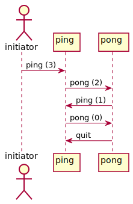
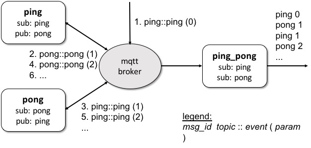

# Summary

scxmlrun is a stand-alone [SCXML](https://www.w3.org/TR/scxml/) processor
written in C++
with the following features:

- it is built on top of [QtSCXML](https://doc.qt.io/qt-5/qtscxml-overview.html)  
- it can be used as a command-line program that simply reads from and writes to local files.
- input/output events can also be received/transmitted over the network via the [MQTT](https://mqtt.org/) protocol.  
- several JavaScript functions, including `SCXML.raise` and `SCXML.send` for raising/sending events in the JSON format, are introduced for interfacing with the underlying SCXML engine.

# Example: [ping\_pong](examples/ping_pong/README.md)

(1) [_ping.sh_](examples/ping_pong/ping.sh) and [_pong.sh_](examples/ping_pong/pong.sh) interact with each other by emitting _ping_ and _pong_ events via MQTT.  
They start communication when an initial _ping (0)_ event is received by _ping.sh_,
upon which _ping.sh_ emits _pong (1)_.  
Then, it is is delivered to _pong.sh_ and responded with _ping (1)_,
and interaction goes on that way.

(2) [_ping\_pong.scxml_](examples/ping_pong/ping_pong.scxml) defines
a state machine that switches states in response to incoming _ping_ and _pong_ events.



(3) When running these together,
[*ping\_pong.scxml*](examples/ping_pong/ping_pong.scxml) works as a _monitor_
for _ping.sh_ and _pong.sh_.  
It monitors all events exchanged between _ping.sh_ and _pong.sh_,
and reports them onto the console.

```
$ cd examples/ping_pong; ./runtest.sh
ping 0  
pong 1  
ping 1  
pong 2  
ping 2  
pong 3  
...
```



Check out [more examples](examples/README.md) if you are interested.

# Installation on Docker

- run `make docker-build` to build a new docker image for scxmlrun
- run `make docker-run` to enter into the image

# Installation on Debian/Ubuntu

## Prerequisites

- [Qt5](http://doc.qt.io/qt-5/) libraries including:
  libQt5Core, libQt5Qml, and libQt5Network  

  run: `apt-get install qt5-default qtbase5-dev qtbase5-private-dev`  
  run: `apt-get install qtdeclarative5-dev qtdeclarative5-private-dev`  

  Note: as of Sep 2018, the packages for Ubuntu are based on Qt v5.9.5.

- [QtSCXML](https://doc.qt.io/qt-5/qtscxml-overview.html)  
  download the corresponding version of the QtSCXML source package  
  run: `wget https://github.com/qt/qtscxml/archive/v5.9.5.tar.gz`

  expand the archive, then build and install QtSCXML  
  run: `cd qtscxml-5.9.5/src/scxml; qmake && make && make install`

- [Mosquitto](https://mosquitto.org): MQTT broker and development library  
  run: `apt-get install mosquitto mosquitto-clients libmosquitto-dev`  

- [JSON for C++](https://github.com/nlohmann/json): JSON parser/serializer  
  run: `apt-get install nlohmann-json-dev`

## Build
- run: `make && make install` in this directory  

## Remark

Instead of [QtSCXML](https://doc.qt.io/qt-5/qtscxml-overview.html),
[uSCXML](https://github.com/tklab-tud/uscxml) can be used
as the SCXML engine.  
To try this option, see [this note](docs/uScxml.md).

# Installation on Darwin

Refer to [this note](docs/macos.md).
