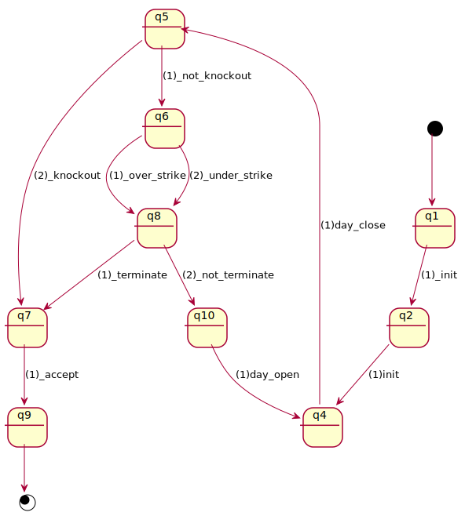

# financial accumulator

_Accumulator_ is a _derivative_ product for purchasing shares with leverage
in a continuous and accumulating manner (often on a daily basis)
until either its settlement date is reached or the share price goes up above
some pre-agreed _knock-out_ price.  
If you are not familiar with its concept, be advised to take a look at
[this wikipedia article](https://en.wikipedia.org/wiki/Accumulator\_\(structured_product\)).  

## accumulator in dsl4sc/scxml

A simplified version of _accumulator_ is defined as a statechart as follows.  
For the detail of the definition (and its monitors listed below),
refer to [this material](accumulator.pdf).

- [accumulator in dsl4sc](accumulator.rules)
- [accumulator in scxml](accumulator.scxml) generated from the above dsl4sc definition

## monitors for accumulator

In addition, several monitors are defined, also as statecharts,
to ensure that the accumulator works exactly as intended.

- [monitor1](monitors/accumulator_mon1.scxml): simple event-pattern checking

  

  
monitor1 statechart

  

  

- [monitor2](monitors/accumulator_mon2.scxml): monitor1 + event parameter validation

  

  
monitor2 statechart

  

  

- [monitor3](monitors/accumulator_mon3.scxml): safety and liveness

  

  
monitor3 statechart

  

  

- [monitor4](monitors/accumulator_mon4.scxml): anomaly detection, a sort of

  

  
monitor4 statechart

  

  

