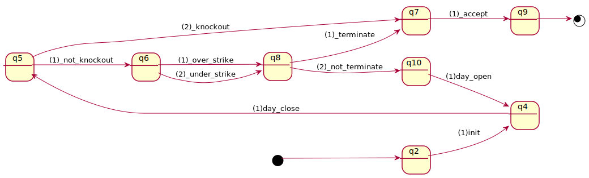

# financial accumulator

If you are not familiar with its concept,
be advised to take a look at
[this wikipedia page](https://en.wikipedia.org/wiki/Accumulator\_\(structured_product\)).  
For the detail of the contract and its monitors defined here,
refer to [this material](accumulator.pdf).

## accumulator in dsl4sc/scxml

- [accumulator in dsl4sc](accumulator.rules)
- [accumulator in scxml](accumulator.scxml) generated from the above dsl4sc definition

## monitors for accumulator

- [monitor 1](monitors/accumulator_mon1.scxml): simple event-pattern checking

  

  
monitor 1

  

  

- [monitor 2](monitors/accumulator_mon2.scxml): 1 + parameter validation

  

  
monitor 1

  

  

- [monitor 3](monitors/accumulator_mon3.scxml): safety and liveness

  

  
monitor 1

  

  

- [monitor 4](monitors/accumulator_mon4.scxml): anomaly detection, a sort of

  

  
monitor 1

  

  

