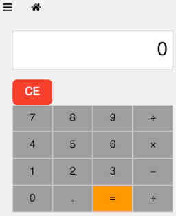
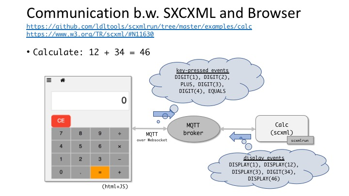

# calc

The [SCXML definition](calc.scxml) originates from [this](https://www.w3.org/TR/scxml/#N11630).

<details>
<summary>calc statechart</summary>
<div></div>
</details>

## scenario: `calc.in` for computing 12 + 34 = 46

The following input events are included in [calc.in](calc.in).

```
{"event" : {"name" : "DIGIT.1"}}  
{"event" : {"name" : "DIGIT.2"}}  
{"event" : {"name" : "OPER.PLUS"}}  
{"event" : {"name" : "DIGIT.3"}}  
{"event" : {"name" : "DIGIT.4"}}  
{"event" : {"name" : "EQUALS"}}  
{"event" : {"name" : "terminate"}}
```

## testing the scenario

```
$ scxmlrun calc.scxml calc.in -o /dev/null  
result: 0  
result: 0  
result: 1  
result: 12  
result: 12  
result: 3  
result: 34  
result: 46
```

## web ui for calc

If you have `firefox` installed on your machine,
just try:

```
$ ./runcalc.sh --with-ui  
```

You will see the following fancy calculator to play with.  
Have fun.

<div></div>


## web ui for calc (in detail)

In case your browser is not firefox or the above one-step option did not work for you,
take the following step-by-step approach to success.

First, you need to make sure that mosquitto is properly configured to work as a bridge between MQTT and Websocket.  
Follow [this instruction](../../docs/websocket.md).

In addition, you also need a local copy of
[mqttws31](https://cdnjs.cloudflare.com/ajax/libs/paho-mqtt/1.0.1/mqttws31.min.js),
in this directory.
Download the file if necessary.

Once these are done, run `runcalc.sh` without invoking a browser:

```
$ ./runcalc.sh --no-ui  
...  
URL: "file:/.../calc_ui.html?host=127.0.0.1&port=9001&sub=calc477855293&pub=calcui477855293"  
...
```

In this case, `runcalc.sh` just starts a process for `calc.scxml` and
generates a URL for connecting to the process via WebSocket (at port 9001 of localhost).

As the final step, open the above url on your browser.  
From a termiinal window, you can do this as follows.

```
$ firefox --new-tab "file:/.../calc_ui.html?host=127.0.0.1&port=9001&sub=calc477855293&pub=calcui477855293"
```

The calculator shown above should pop up and work as you click its buttons.

As a remark, if you are interested in how events are exchanged between `scxmlrun` and your browser, refer to the following diagram.

<details>
<summary>calc with web ui</summary>
<div></div>
</details>
