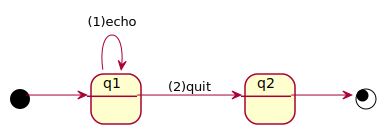

# echo

## statechart: `echo.scxml`

The [statechart](echo.scxml) receives one or more _echo_ events and prints out the event parameter onto the console.
It terminates upon a _quit_ event.
See also [README.md](https://github.com/ldltools/dsl4sc/examples/echo/README.md)
in the dsl4sc repository.



## transmitting events to the the statechart directly

```
$ cat <<EOF | scxmlrun echo.scxml  
{"event" : {"name":"echo", "data":"hello"}}  
{"event" : {"name":"echo", "data":"world"}}  
{"event" : {"name":"quit"}}  
EOF
```

then we immediately get the following console messages:

```
hello  
world
```

## transmitting events to the the statechart via MQTT

events can be passed over the network:

```
$ scxmlrun echo.scxml --sub echo &  
$ cat <<EOF | mosquitto_pub -t echo -l  
{"event" : {"name":"echo", "data":"hello"}}  
{"event" : {"name":"echo", "data":"world"}}  
{"event" : {"name":"quit"}}  
EOF
```

## test automation using [shelltest](https://packages.ubuntu.com/bionic/shelltestrunner)

for convenience, the above examples are defined respectively in
[echo.conf](echo.conf) and [echo\_mqtt.conf](echo_mqtt.conf),
and can be tested, using the _shelltest_ tool, as follows

```
$ shelltest echo.conf  
:echo.conf: [OK]  
...  
$ shelltest echo_mqtt.conf  
:echo_mqtt.conf: [OK]  
...
```
