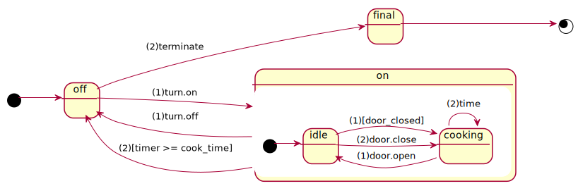

The [SCXML definition](microwave-01.scxml) originates from [this](https://www.w3.org/TR/scxml/#N11619).



## scenario: `microwave-01.in`

The following input events are included in [microwave-01.in](microwave-01.in).

```
{"event" : {"name" : "turn.on"}}  
{"event" : {"name" : "door.open"}}  
{"event" : {"name" : "door.close"}}  
{"event" : {"name" : "time"}}  
{"event" : {"name" : "time"}}  
{"event" : {"name" : "time"}}  
{"event" : {"name" : "time"}}  
{"event" : {"name" : "time"}}  
{"event" : {"name" : "terminate"}}
```

## running of the statechart

```
$ scxmlrun microwave-01.scxml microwave-01.in  
off 0  
on 0  
idle 0  
coocking 0  
idle 0  
coocking 0  
off 5
```
