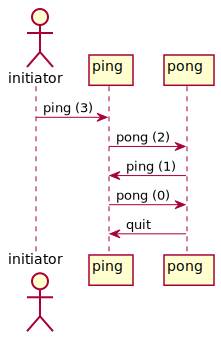

(1) [ping.sh](ping.sh) and [pong.sh](pong.sh) interact with each other by emitting _ping_ and _pong_ events via MQTT.  
They start communication when an initial _ping (0)_ event is received by _ping.sh_,
upon which _ping.sh_ emits _pong (1)_.
Then, it is is delivered to _pong.sh_ and responded with _ping (1)_ and so on.

(2) [*ping\_pong.scxml*](ping_pong.scxml) is generated
from [*ping\_pong.rules*](ping_pong.rules)
that is defined in *dsl4sc*.

&ensp; **protocol**  
&ensp;&ensp; (ping; pong)\*;;  
&ensp;&ensp;&ensp; // pairs of *ping* and *pong* events (repeated 0 or more times)  
&ensp; **rule**  
&ensp;&ensp; **on** ping **do** { console.log ("ping", \_event.data); };  
&ensp;&ensp; **on** pong **do** { console.log ("pong", \_event.data); };  



(3) [*ping\_pong.scxml*](ping_pong.scxml) works as a _monitor_ for the above 2 programs.
It monitors all events exchanged between _ping.sh_ and _pong.sh_,
and reports them on the console.

```
$ ./runtest.sh
ping 0  
pong 1  
ping 1  
pong 2  
ping 2  
pong 3  
...
```


