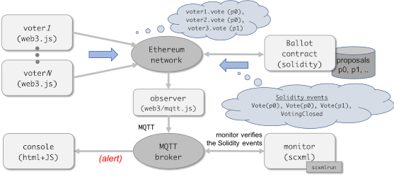

# voting

## Contract: [Ballot](contracts/Ballot.sol) in Solidity

[This contract](contracts/Ballot.sol) originally appears in [this Solidity tutorial material](https://solidity.readthedocs.io/en/v0.4.24/solidity-by-example.html#voting).

The contract is for selecting one out of several proposals (on a majority vote)
through a series of 3 different sorts of transactions, namely
`giveRightToVote`, `delegate`, and `vote`.

### DSL4SC/SCXML version of Ballot (optional)

In addition to the Solidity version,
we also provide another [DSL4SC version](contracts/Ballot.rules) of the contract:

- it can replace `Ballot.sol` and run as an Ethereum smart contract (when combined with [`proxy.sol`](contracts/proxy.sol)).
- alternatively, it can coexist with `Ballot.sol` and run as a _monitor_ for `Ballot.sol`.


## Scenarios

- [scenario1](scenarios/scenario1.js)

  `GiveRightTo` (voter1-3), followed by `Vote` (voter1-3)

  The winning proposal should be: `proposal0`

- [scenario1](scenarios/scenario2.js)

  `GiveRightTo` (voter1-3), followed by `Vote` (voter1-2) and `Delegate` (voter3)

  The winning proposal should be: `proposal1`

- [invalid1](scenarios/invalid1.js)

  `GiveRightTo` (voter1-3), followed by `Vote` (voter1-2)

  This should fail since the voting terminates without a vote of voter3.

## Monitors

- [monitor1](monitors/monitor1.rules)

  This monitor ensures that each voting process terminates with a `VotingClosed` event.

  ```
  protocol GiveRightTo; (GiveRightTo + Vote + Delegate)*; VotingClosed ;;
  ```

  <details>
    <summary>monitor1 (SCXML)</summary>
    <div></div>
  </details>

- [monitor2](monitors/monitor2.rules)

  (to be filled in)

## Testing Ballot.scxml using scxmlrun

`make test` invokes `shelltest` as follows

```
shelltest voting.conf
```

## Testing Ballot.sol using [truffle](https://truffleframework.com/) and [ganache](https://truffleframework.com/ganache)

(This is Solidity-only testing.)

### Prerequisites

We need `truffle` and `ganache-cli` for testing.  
`Ballot.sol` in this directory has been tested using the following versions.

```
$ truffle version  
Truffle v5.0.9 (core: 5.0.9)  
Solidity v0.5.0 (solc-js)  
Node v10.15.1  
Web3.js v1.0.0-beta.37  
$ ganache-cli --version  
Ganache CLI v6.4.1 (ganache-core: 2.5.3)
```

Note that if you are not familiar with testing smart contracts on a local Ethereum network,
please take a look at [this brief memo](../../docs/ethereum.md).

### Comppiling Ballot.sol

```
$ make truffle-compile  
```

### Deploying and testing Ballot.sol

Several test cases for Ballot.sol are defined,
using the [mocha](https://mochajs.org/) test framework that is integrated into truffle,
and stored in the scenarios directory.  
To run these, you just need to take the following steps.

```
$ make ganache-start  
$ make test-solidity  
```

<details>
  <summary>Caveat</summary>
  <div>
    When something goes wrong, it is often the case that ganache needs to be *fully* restarted.
    To do so for sure, try the following.
    <ul>
      <li>`make ganache-stop`</li>
      <li>`make clean`</li>
      <li>`make ganache-start`</li>
    </ul>
  </div>
</details>


### Testing Ballot.sol connected _with_ a monitor in SCXML

We can _monitor_ events that Ballot.sol raises by attaching a monitor in SCXML.  
More specifically,
we inject an [_observer script_](monitors/observer.js),
which listens to events emitted by `Ballot.sol` and
forwards them to the monitor through a MQTT broker.

<details>
  <summary>contract and monitor</summary>
  <div></div>
</details>

To connect Ethereum and MQTT in this way,
we need `mqtt.js` in addition to `web3.js`
for connecting the contract and the monitros.

```
$ npm install web3@0.20  
$ npm install mqtt  
```

To test `Ballot.sol` with our monitor, type in the following commands.

```
$ make ganache-restart  
$ make test-combined  
```
